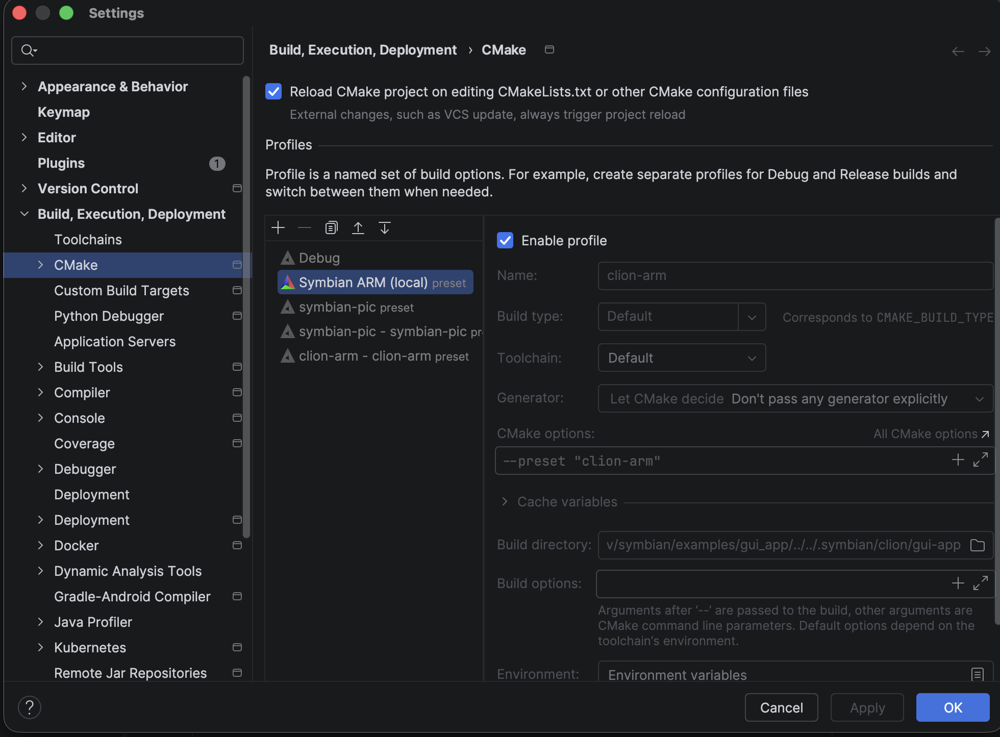

# Configure CLion for a Symbian application

The GUI example is a CMake project whose compiler target is 32-bit ARM. CLion
can edit and index it with the same target flags used by the command-line
build. The built ARM ELF is converted into a Symbian E32 executable before an
emulator can load it.

## Before opening the IDE

1. [Install or build the application SDK](projects.md), then prepare the public
   headers and import proxies in the [source prerequisites](source-prerequisites.md).
2. From the repository root, check that the shared preset configures and builds:

   ```sh
   cd examples/gui_app
   cmake --preset symbian-pic
   cmake --build --preset symbian-pic
   ```

3. Return to the repository root and run `uv run symbian emu configure-ide` to
   create local Run/Debug settings for the prepared example. These settings
   live in ignored `.idea` files because they contain machine paths.

The shared `symbian-pic` preset uses Ninja, the SDK ARM toolchain file and
`SYMBIAN_TARGET_ARCH=armv6`. It requests `compile_commands.json`, which records
real compiler arguments for editor indexing. A local ignored `clion-arm` preset
may override tool locations on a prepared machine; it is optional for a fresh
checkout.

## Load the CMake profile

1. Open `examples/gui_app` as its own project in CLion. The source root is
   small enough for focused code navigation.
2. If CLion does not load the preset automatically, use **Help → Find Action →
   Load CMake Presets**, select `symbian-pic`, and enable the imported profile
   under **Settings → Build, Execution, Deployment → CMake**. Imported preset
   profiles can start disabled. [JetBrains' preset guide](https://www.jetbrains.com/help/clion/cmake-presets.html)
   shows the current controls.
3. Reload CMake. Check that `app.cc`, `window_server.cc`, `startup.cc` and
   `startup.S` belong to `gui_app`, and that the profile uses the ARM triple
   rather than a host target. The expected compiler database is
   `.symbian/cmake/gui-app/compile_commands.json` for the shared preset.



*In the prepared project, the local `clion-arm` preset is enabled under
**Settings → Build, Execution, Deployment → CMake**. On a new checkout, enable
the shared `symbian-pic` preset instead unless you have created a local preset.*

The SDK profile also publishes `gui_app_e32` for E32 output. Building an ELF
alone checks compilation and linking; the E32 conversion and emulator run are
separate steps. The [GUI build guide](gui-build.md) explains those artifacts.

## If the profile cannot configure

| Symptom | Check |
| --- | --- |
| `symbian-pic` is missing | Load CMake Presets through Find Action; then enable the imported profile. |
| ARM headers are unresolved | Confirm the prepared SDK and `SYMBIAN_GUI_SDK_INCLUDE`; reload CMake after a path change. |
| LLD or Ninja is missing | Check `cmake`, `ninja`, `clang++` and `ld.lld` on the IDE toolchain `PATH`. |
| A local `clion-arm` toolchain name is unavailable | Select the shared `symbian-pic` preset or restart the IDE after installing a named toolchain. |
| Indexing looks like host code | Inspect the selected profile and its `compile_commands.json` for `--target=armv6-none-eabi`. |

The prepared project was configured in an IntelliJ IDEA installation with the
CLion plugin, and its target model resolved the GUI C++ and assembly sources.
That is bounded editor evidence. The [Run and Debug guide](clion-run-debug.md)
explains guest execution and breakpoints; the [advanced guide](clion-advanced.md)
covers retained artifacts and manual debugging.
