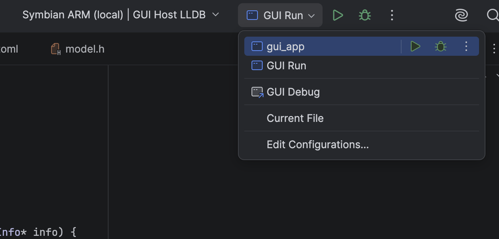
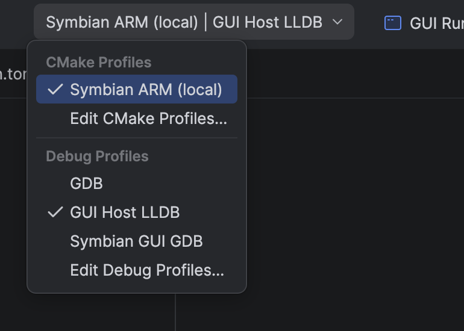

# Run and debug a Symbian application in CLion

CLion's **GUI Run** starts the SDK supervisor, which builds the current source,
publishes its E32 image and launches a fresh disposable EKA2L1 instance.
EKA2L1 is the emulator that runs the guest Symbian executable and exposes an
ARM GDB connection for source debugging. **GUI Debug** uses that connection;
the host debugger for the launcher is a different profile.

The saved configurations appear in the IDE toolbar once `configure-ide` has
generated the local project settings:

*Choose **GUI Run** to launch the guest through the supervisor. Choose
**GUI Debug** for the guest GDB connection. The `gui_app` entry is the ordinary
CMake target and has a different role.*

## Run the counter

1. [Load the ARM CMake profile](clion-profiles.md) in the `examples/gui_app`
   project and [import compatible firmware](firmware.md). A named ROM/Z
   fixture is required for this workflow.
2. Run `uv run symbian emu configure-ide` from the repository root if the
   saved configurations are absent. Reopen the project to load the generated
   `.idea` settings.
3. Select **GUI Run** and press **Run**. The configured executable is the host
   supervisor, not `gui_app.elf`. It builds and checks E32 before launching
   the guest in a disposable emulator instance.
4. In the emulator, tap the counter controls, then use the guest **Exit**
   control. CLion's Stop button ends only this owned frontend. The run keeps
   logs and input/binary digests beneath `.symbian/gui-runs` for inspection.

A successful ARM build is only a build result. A visible counter and normal
emulator exit add guest evidence, but neither proves physical Nokia 808
compatibility.

## Stop at a guest source line

1. Put a breakpoint in `GuiMain` or `DrawGui` in the GUI source.
2. Select **GUI Debug** and its **Symbian GUI GDB** native debug profile.
   The host debugger follows the native launcher and cannot stop in ARM guest
   C++. The screenshot shows macOS **GUI Host LLDB**; Linux may have **GUI Host
   GDB** instead. Guest debugging uses **Symbian GUI GDB** on either host.

   

   *The debug profile selector is separate from the GUI Run/Debug configuration
   selector. This capture still has host LLDB selected; switch to **Symbian
   GUI GDB** before guest debugging.*
3. Press **Debug**. The supervisor publishes the current E32, starts a halted
   instance and waits for the emulator's loopback GDB stub. The saved Remote
   Debug configuration connects to `127.0.0.1:24689`.
4. Resume execution in the IDE. The GDB hook relocates symbols after the
   guest process maps, so source breakpoints can resolve to its actual load
   address. Inspect variables and step through the guest; Stop cleans up the
   owned emulator child.

The supported check has stopped at a guest source breakpoint in the IDE.
Comprehensive stack unwinding remains unverified. If the debug profile is
missing, reopen the GUI project after running `configure-ide`. If the port is
busy, stop the conflicting session before starting another; the supervisor
rejects a busy port rather than attaching to an unrelated process.

[JetBrains' Remote Debug guide](https://www.jetbrains.com/help/clion/remote-debug.html)
explains CLion's debugger fields. The repository's generated settings supply
its symbol file, source mappings and guest GDB selection for this example.
The [advanced CLion guide](clion-advanced.md) shows the manual path when you
need to inspect those pieces individually.
