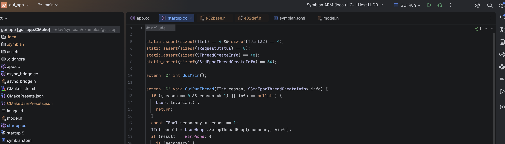

# Use CLion with Symbian applications

CLion is a CMake-aware C++ IDE. This project uses its CMake profiles to keep
host tools and 32-bit ARM guest code separate. The editor can index the ARM
headers and source using the same compiler settings as the build. A saved Run
configuration launches the example through the SDK's emulator supervisor;
a separate Remote Debug configuration attaches ARM GDB to the guest.



*The prepared GUI example in IntelliJ IDEA with the CLion plugin. The toolbar
shows the selected ARM CMake profile and saved GUI Run configuration. The IDE
capture shows configuration and source indexing, not a running guest.*

| Step | Guide | What to check |
| --- | --- | --- |
| 1 | [Configure profiles](clion-profiles.md) | Open `examples/gui_app`; load `clion-arm`; reload CMake |
| 2 | [Run and debug](clion-run-debug.md) | Use GUI Run for a visible app and GUI Debug for guest breakpoints |
| 3 | [Inspect indexing and advanced paths](clion-advanced.md) | Compilation databases, retained sessions and manual GDB |

The [Build a real GUI app](from-source.md) explains the underlying ELF, E32,
firmware and emulator steps. CLion displays source and controls these tools;
it does not turn an ARM ELF into a host executable. A generated app may use the
[standalone project guide](projects.md) instead of the source example.

## Develop the SDK itself

Open the repository root and select `guest-probes-armv6` or
`guest-probes-armv5t` (the local IDE profiles have a `clion-` prefix).
These profiles build the current runtime, device APIs, WebSocket codec,
TLS wrapper and guest concurrency archives. Applications in that graph use
the same archives and prefer the workspace's current public headers. Editing
an SDK header or implementation therefore updates the application build and
its compiler context without exporting an SDK first.

Prepare the [source dependencies](source-prerequisites.md) first. Root
profiles create `.symbian/workspace-inputs` from those repository inputs,
including platform headers, complete OS and guest Qt imports and patched
Abseil sources. Runtime, Abseil, Mbed TLS and device API archives are built
from source. Root profiles ignore the active SDK and project SDK selectors;
standalone application projects use their selected installed SDK.
The first reload after an input change can regenerate many frozen import
interfaces. CMake shows the preparation phase and progress count; the same
timestamped messages remain in ignored `.symbian/workspace-inputs.log`.
Concurrent IDE profiles wait for one shared preparation lock. An unchanged
reload reuses the prepared inputs.

The host `debug` profile builds host tools. Its `gui_app` target builds the
source ARM graph in `build/debug/guest-armv6`, and `gui_app_e32` converts the
result with the source-built host tool. Use a guest profile to edit and index
ARM sources. The guest index profile exposes each example's ARM CMake target
without requiring a host `symbian-native` converter during IDE reload; E32
publication remains in the host `debug` graph or a standalone installed-SDK
project. Host and guest compiler caches remain separate.

```sh
cmake --preset debug
cmake --build --preset debug --target gui_app_e32
cmake --preset guest-probes-armv6
cmake --build --preset guest-probes-armv6
cmake --build build/guest-probes-armv6 --target gui_app qt_app_classic
```

Each profile writes its own `compile_commands.json`. These builds do not
establish emulator or physical-device compatibility.

The root `.run/` directory also supplies **GL App Run/Debug**,
**Qt App Run/Debug**, and **SDL2 App Run/Debug**. Run selects the host `debug`
profile and the corresponding `.run/gl_app-run`, `.run/qt_app_classic-run`, or
`.run/sdl2_app-run` launcher. These checked-in wrappers work before the optional
host CMake executables have been built. Both Run and Debug build the ARMv6
example and libraries from source, then supervise a disposable emulator
instance. They use each example's firmware settings and ignore installed SDK
selectors. Debug discovers
ARM GDB on PATH or through `SYMBIAN_GDB`; it uses ports 24701, 24702, and
24703 respectively and publishes symbols under
`.symbian/workspace-apps/<example>`.
SDK-owned emulator sessions fit the displayed guest screen mode without a
surrounding layout margin. The native title, menu, and status areas remain
available. Windowed size follows screen mode changes, including rotation.
Opening an example directory separately provides its own **Standalone Run/Debug**
configurations using the selected installed SDK and `symbian-pic` profile.
