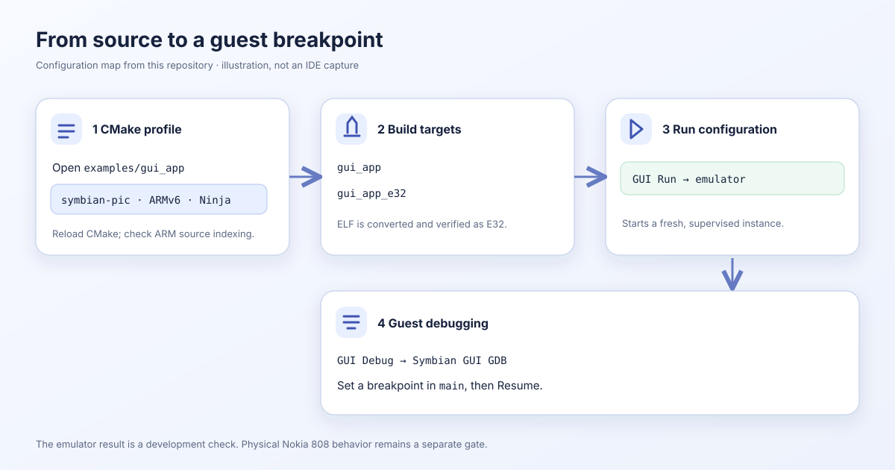

# Use CLion with Symbian applications

CLion is a CMake-aware C++ IDE. This project uses its CMake profiles to keep
host tools and 32-bit ARM guest code separate. The editor can index the ARM
headers and source using the same compiler settings as the build. A saved Run
configuration launches the example through the SDK's emulator supervisor;
a separate Remote Debug configuration attaches ARM GDB to the guest.

*Configuration map derived from this repository. It is an illustration of the
required choices, not a capture of CLion's interface.*

| Step | Guide | What to check |
| --- | --- | --- |
| 1 | [Configure profiles](clion-profiles.md) | Open `examples/gui_app`; load `clion-arm`; reload CMake |
| 2 | [Run and debug](clion-run-debug.md) | Use GUI Run for a visible app and GUI Debug for guest breakpoints |
| 3 | [Inspect indexing and advanced paths](clion-advanced.md) | Compilation databases, retained sessions and manual GDB |

The [GUI source walkthrough](from-source.md) explains the underlying ELF, E32,
firmware and emulator steps. CLion displays source and controls these tools;
it does not turn an ARM ELF into a macOS executable. A generated app may use the
[standalone project guide](projects.md) instead of the source example.
