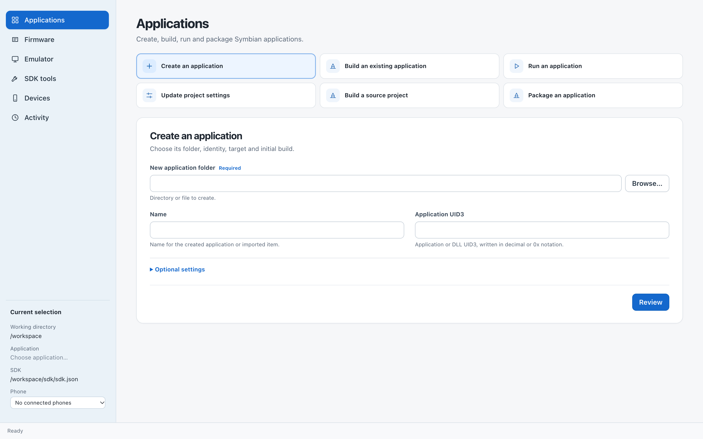
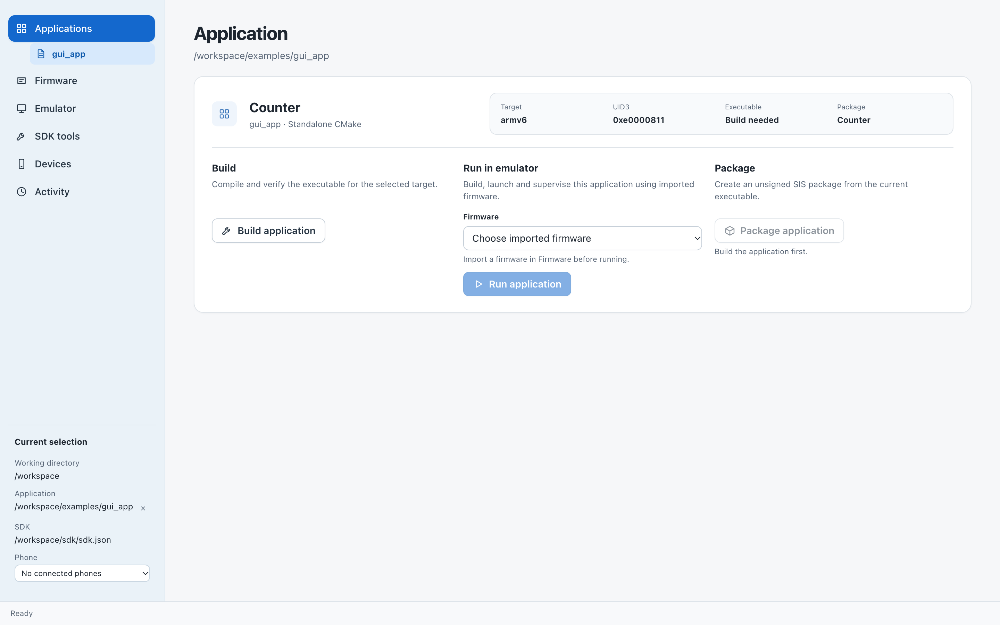

# Symbian Console

Symbian Console is the desktop view of the same SDK commands used in a
terminal. Use it to create a project, build an E32 executable, choose imported
firmware, run in the emulator and prepare a SIS package. The screenshots below
use the actual frontend with sample paths and no connected phone.

## Create and select an application

1. Start the Console with `symbian console` from the repository root.
2. Choose **Applications** and **Create an application**. Enter a new folder,
   name and application UID3, then review the proposed settings.
3. Select the created project in the sidebar. Its application page collects
   **Build**, **Run in emulator** and **Package** in one place.

*Applications page, captured from the current frontend with a sample SDK path.*

*Selected project before its first build. Import compatible firmware before
running; Package becomes available after Build.*

## Build, run and package

With a project selected, choose **Build** and review the result. The project
page shows the produced executable and retains tool output. To launch it,
first [import compatible firmware](firmware.md), then choose **Run in
emulator**. The console supervises the emulator session and reports its guest
exit.

Choose **Package** after a successful build to create an unsigned SIS. A SIS
holds application files for installation; producing one does not install it on
a phone. See [packaging](packaging.md) for its contents and checks.

For the full navigation map, firmware browser, USB inspector and the desktop
implementation, see the [console reference](../reference/console-interface.md).
